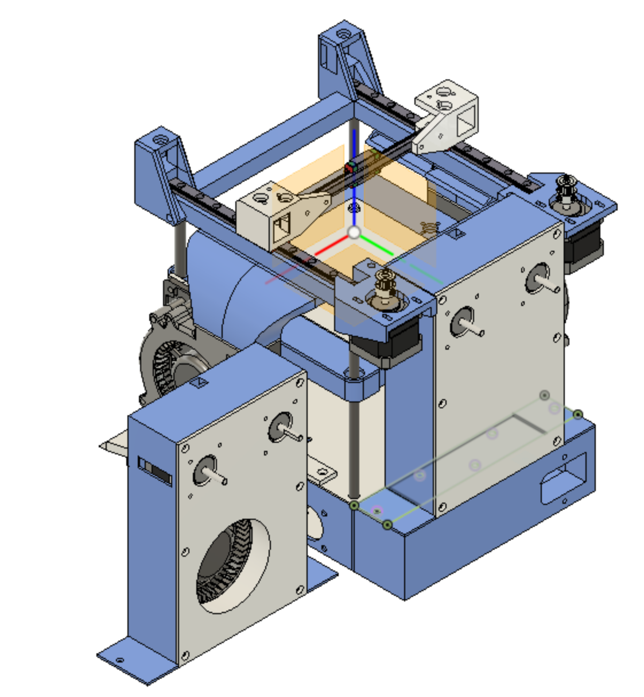
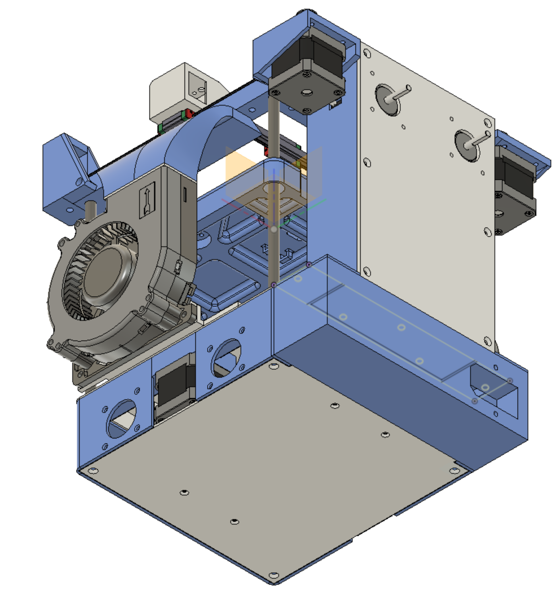

# Rook Modified

Welcome to my fork of the [Rook](https://github.com/rolohaun/Rook) DIY 3D Printer by [Rolohaun 3D](https://github.com/rolohaun)

There were a few tweaks I wished to make to the original project to suit my own needs and make use of some spares.

As stated in the original project, this is a small CoreXY 3D printer with a 120x120 build volume

## Original

## Modified

This is a work in progress, see below for planned modifications

For now no BOM is yet provided for this exact build, but is largely similar to the original BOM [here](https://docs.google.com/spreadsheets/d/1oHDEvndkkvPFOBis4atrHRHK_DMTvttFUFWDg2He6To/edit#gid=0)

## Modifications

I am currently still printing pars so all of these mods are currently untested!

- Enclosed frame design so electronics can be housed internally
- 120mm side blower mounts modified from lightbrigade design
- New printbed design to accomodate 120mm heated print beds from [AliExpress](https://www.aliexpress.com/item/32817223944.html?spm=a2g0o.productlist.0.0.5a77207bQT2yfQ&algo_pvid=f581cb7c-eb07-4322-829c-548b666a4e14&algo_exp_id=f581cb7c-eb07-4322-829c-548b666a4e14-0&pdp_ext_f=%7B%22sku_id%22%3A%2264670618668%22%7D&pdp_npi=2%40dis%21GBP%2114.81%2111.11%21%21%212.56%21%21%402101d91e16689701025672224e1a4d%2164670618668%21sea&curPageLogUid=M2HsGsdnuVoj)
- Internal mounts in base for BIGTREEETECH Manta M8P board
- Internal mounts for a Meanwell LRS350 power supply
- Combined cable managment and dual extruder backbox
- IEC power connector

## Future Modifications
- Support for E3D v6 style hotends (Got a few spares lying around)
- Part cooling fan(s) on print head (removal of 120mm fan)
- Camera mounts on top frame
- RJ45 network port on rear
- WiFi Antenna Mounting

